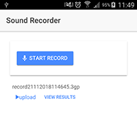
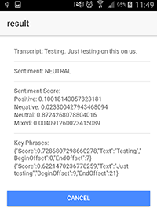
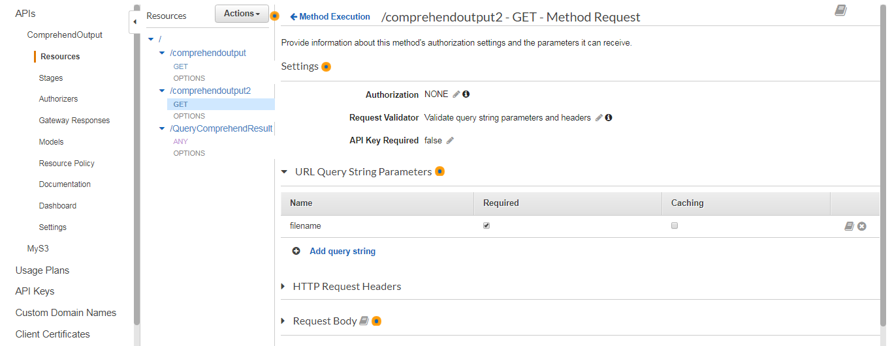

# ChatDiary - A demo that uses AWS with a mobile app for speech analysis
Mobile app: built with Ionic 3 (however the AWS part should work with any mobile app)

Job flow:
Record audio from mobile app -> upload to AWS S3 -> convert file to mp3 -> Amazon Transcribe -> Amazon Comprehend -> store results in Amazon DynamoDB -> query results from any app with Lambda API

the app looks like:

after AWS does all its work, the result looks like:

### Ionic 3
If you choose to work with Ionic, you need to
1. install ionic as per instruction: https://ionicframework.com/docs/intro/installation/

2. download the project or create your project and copy the files 

3. install all the plugins needed: by running the following command at the project folder: ionic state restore --plugins
(or try ionic state reset -- plugins )

4. Please familiarise yourself with Amazon Amplify: https://aws-amplify.github.io/docs/js/ionic

5. AWS related details are added in main.ts

### Settin up AWS
After creating an account with AWS, you will need to set up the following:(and all the lambda roles for different services, omitted here):

Initial set up and file upload:
1. create an identity pool (not user pool) in Cognito (make sure it allows no auth access to api, unless you have individual user accounts set up)

2. create an S3 bucket for uploading the audio files from the app (this is the one to be added to ionic/your app)  

Convert the audio format to mp3 (3gp to mp3, assuming Android)
3. create an S3 bucket for converted mp3

4. set up elastic transcoder to create a pipeline id 		

5. create a lambda to start the conversion, triggered by a file created in the source S3
	(see the index.js in the folder aws/convert3gpToMp3 for the actual lambda function)
	set up environment variables accordingly
	
	
				
		
Create Transcribe job to be triggered on file created in the bucket with the converted mp3 files
6. create an S3 bucket to collect transcribe results

7. creare a lambda to trigger the Transcribe job (see index.py in the folder aws/FlorenceTranscribe for the actual function)
	set up environment variables accordingly
		
	
		
	
Create Comprehend job to analyse Transcribed audio and save the result in database
8. create a dynamoDB table to store the Comprehend results (just the table name is needed for the lambda)

9. create a lambda to trigger Comprehend on file created in the bucket that store Transcirbe results,(see lambda_function.py in aws/FlorenceComprehend for the actual function)
	set up environment variables accordingly
		
	
		
	
Allow external app to query the final results
10. create a lambda to search for the correct record in the database (see index.js in QueryComprehendResult for the actual function)

11. create an API link that an external app can access the last lambda, the lambda can actually generate an api link by itself, or we can use API gateway and integrate with the lambda(see screenshots)
	
	
	
	
	
12. call this API endpoint to query the result, the app will need to include the filename of the audio file in its request to get the corresponding result

